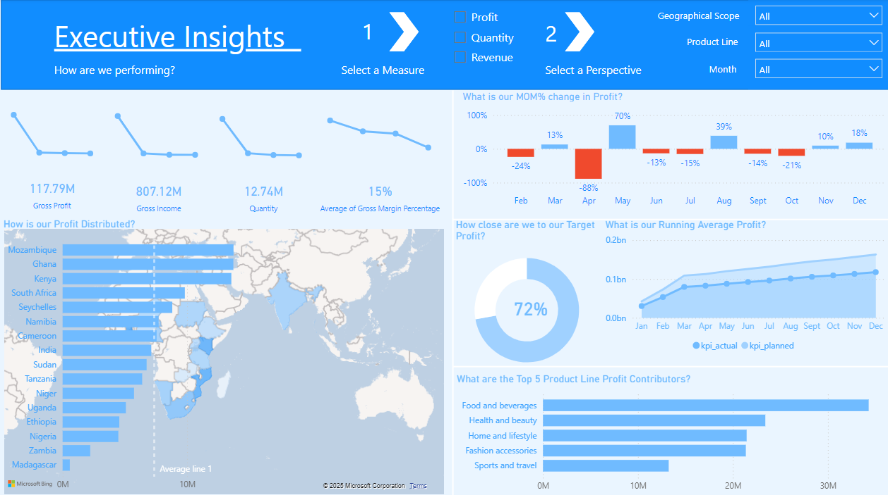

# Sales of Supermarket Chain in Power BI Dashboard

As I’m unable to publish my Power BI dashboard online using personal email, I’ve prepared the following detailed description to help you better understand the dataset and the insights it provides:

## Dataset Overview:

The dataset (in year 2020) includes the following columns:

- Date
- Country
- Branch
- Product Line
- Unit Price
- Quantity
- Payment Type
- Gross Margin Percentage
- Gross Income
- Gross Profit
- Planned Revenue
- Planned Profit
- Planned Quantity

The main focus is on the sales performance of various product lines in different countries in the region, which includes:

- **Electronic Accessories**
- **Fashion Accessories**
- **Food and Beverages**
- **Health and Beauty**
- **Home and Lifestyle**
- **Sports and Travel**

## Executive Insights

**Select a measure:**

Users can select one of the following measures for analysis:

- **Profit**
- **Quantity**
- **Revenue**

**Select a perspective:**

Further filtering options allow users to drill down by **country**, **product line**, and **month** via a dropdown list.

## Key Business Metrics Displayed

The dashboard highlights four key metrics for each quarter of 2020:

- **Gross Profit**
- **Gross Income**
- **Quantity**
- **Average Gross Margin Percentage**

## Sections of the Dashboard

The dashboard is divided into five key sections for easy navigation and exploration:

1. **Distribution of Profit, Quantity, and Revenue**
2. **Month-over-Month (MOM) Percentage Change in Profit, Quantity, and Revenue**
3. **Actual vs. Target: Comparing Actual vs. Planned Profit, Quantity, and Revenue**
4. **Running Average of Profit, Quantity, and Revenue**
5. **Top 5 Product Lines Contributing to Profit, Quantity, and Revenue**

---

I hope this summary helps clarify the structure and insights of the dashboard. Please feel free to reach out if you’d like more details or have any questions!
